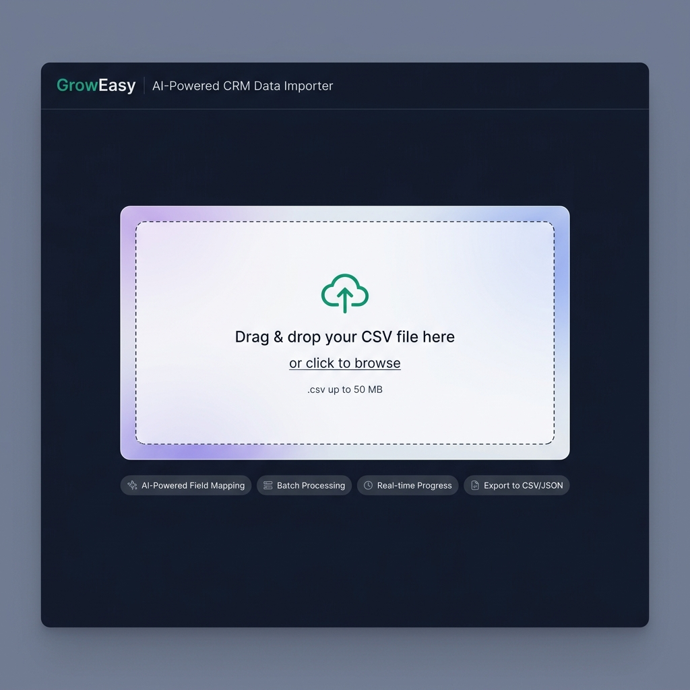
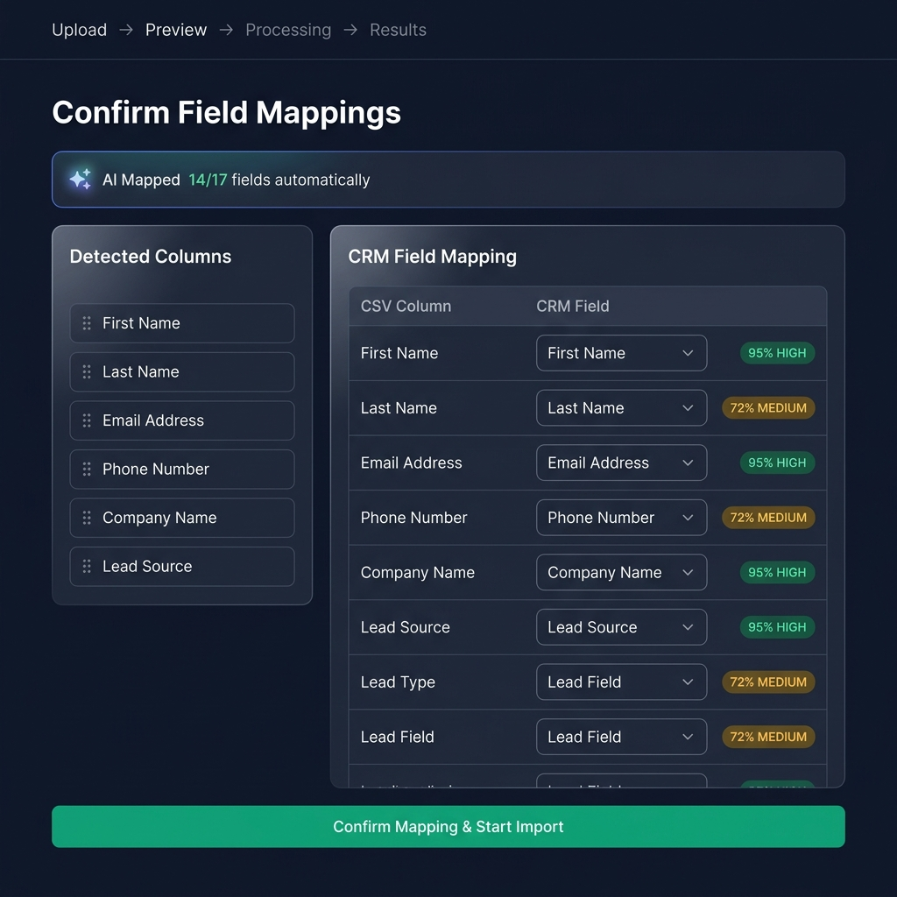
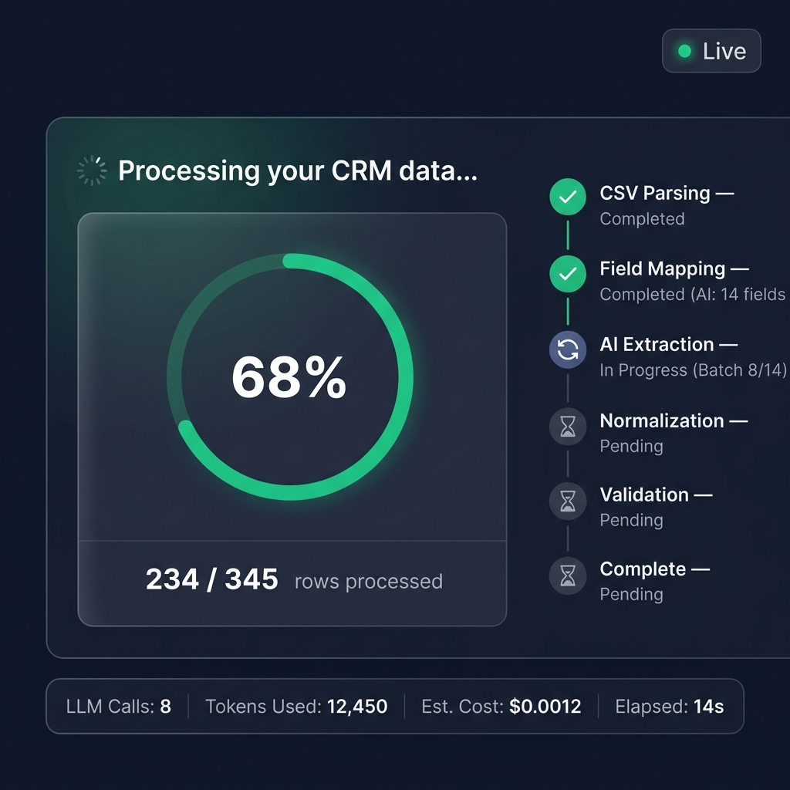
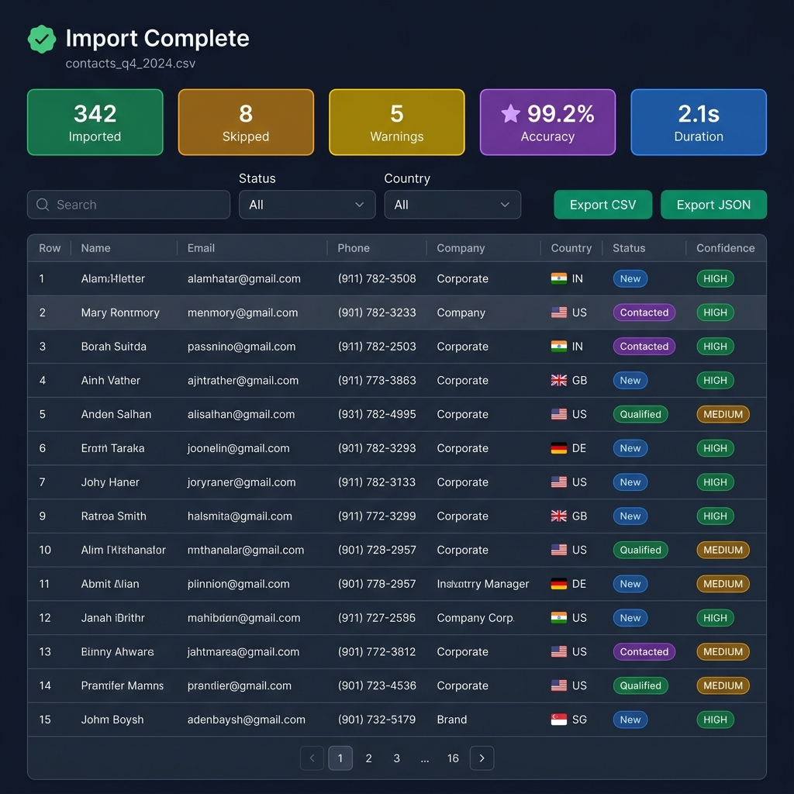
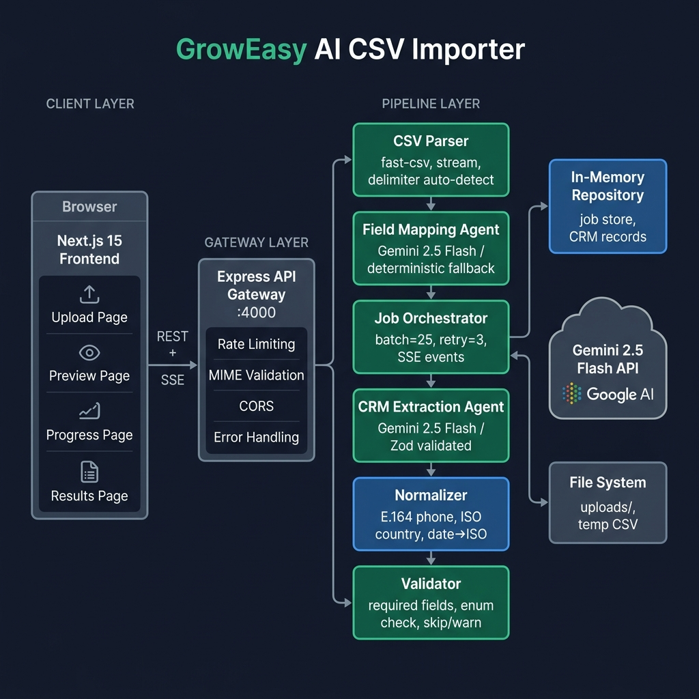

<div align="center">

# 🌱 GrowEasy — AI-Powered CRM CSV Importer

**Transform raw CSV contacts into clean, structured CRM data using Gemini AI**

[](https://github.com/abhay-pratap-singh/GrowEasy/actions)
[](LICENSE)
[](https://nodejs.org)
[](https://www.typescriptlang.org)
[](https://ai.google.dev)

</div>

---

## 📸 Screenshots

| Upload | Field Mapping Preview |
|--------|----------------------|
|  |  |

| Real-time Progress | Results Dashboard |
|--------------------|------------------|
|  |  |

---

## 🏗️ Architecture



```
Browser (Next.js 15)
    │
    │  REST + Server-Sent Events
    ▼
Express API Gateway (:4000)
  ├─ Rate Limiting       (20 uploads / 15 min)
  ├─ MIME Validation     (.csv only)
  ├─ CORS + Helmet
  └─ Structured Logging  (pino)
    │
    ▼
CSV Parser              (fast-csv, auto-detects delimiter)
    │
    ▼
Field Mapping Agent     (Gemini 2.5 Flash → deterministic fallback)
    │
    ▼
Job Orchestrator
  ├─ Batch Builder      (25 rows/batch)
  ├─ Retry Logic        (3× exponential backoff)
  └─ SSE Event Emitter
    │
    ▼
CRM Extraction Agent    (Gemini 2.5 Flash → Zod validation)
    │
    ▼
Normalizer              (E.164 phone · ISO-3166 country · ISO-8601 date)
    │
    ▼
Validator               (required fields · enum check · skip/warn)
    │
    ▼
In-Memory Repository    (job store + CRM records)
```

---

## ✨ Features

| Feature | Description |
|---------|-------------|
| 🤖 **AI Field Mapping** | Gemini 2.5 Flash automatically maps CSV columns to CRM fields with confidence scores |
| 📊 **Batch Processing** | Processes 25 rows per batch with 3× exponential backoff retry |
| 📡 **Real-time Progress** | Server-Sent Events stream live progress to the browser |
| 🔧 **Deterministic Normalizer** | Phones → E.164, Countries → ISO-3166, Dates → ISO-8601 |
| ✅ **Smart Validation** | Skip only rows with no email AND no phone; invalid enums become warnings |
| 🌐 **Multi-format CSV** | Auto-detects comma, semicolon, tab delimiters; handles quoted fields |
| 📥 **Export Results** | Download clean CRM data as CSV (formula-injection protected) or JSON |
| 🛡️ **Security** | Rate limiting, MIME validation, CSV formula injection protection (CWE-1236) |
| 🔄 **Graceful Fallback** | Works fully offline without a Gemini API key (deterministic mode) |

---

## 🚀 Quick Start

### Prerequisites

- **Node.js** 20+ and **npm** 10+
- **Git**
- (Optional) A [Google Gemini API key](https://aistudio.google.com/app/apikey) for AI mode

### 1. Clone & Install

```bash
git clone https://github.com/abhay-pratap-singh/GrowEasy.git
cd GrowEasy
npm install
```

### 2. Configure Environment

```bash
# Copy the example environment file
cp apps/backend/.env.example apps/backend/.env

# Edit with your values (optional — app works without Gemini key)
```

```env
# apps/backend/.env
PORT=4000
NODE_ENV=development
GEMINI_API_KEY=your_gemini_api_key_here   # Leave as-is for deterministic mode
CORS_ORIGIN=http://localhost:3000
UPLOAD_DIR=./uploads
MAX_FILE_SIZE_MB=50
LOG_LEVEL=info
```

> **Note:** Without a valid Gemini API key, the app runs in **deterministic fallback mode** — all pipeline stages work using rule-based matching. No AI features are degraded except semantic extraction.

### 3. Start Development Servers

```bash
# Start both backend and frontend simultaneously
npm run dev
```

- **Frontend:** http://localhost:3000
- **Backend API:** http://localhost:4000
- **Health check:** http://localhost:4000/health

---

## 🐳 Docker

### Run with Docker Compose

```bash
# Copy and configure env (optional — works without a key)
cp apps/backend/.env.example apps/backend/.env

# Start the full stack
docker compose up --build

# Stop
docker compose down
```

The app will be available at **http://localhost:3000**.

### Individual Container Builds

```bash
# Backend
docker build -f apps/backend/Dockerfile -t groweasy-backend .

# Frontend
DOCKER_BUILD=true docker build -f apps/frontend/Dockerfile -t groweasy-frontend .
```

---

## 🧪 Testing

```bash
# Run all unit + integration tests (54 tests, no API key needed)
npm run test --workspace=apps/backend

# Watch mode during development
npx vitest --workspace=apps/backend
```

Test coverage includes:
- CSV parser (21 tests) — delimiter detection, empty rows, quoted fields
- Normalizer (12 tests) — phone E.164, 60+ country ISO codes, date formats
- Validator (6 tests) — skip/warn/fail logic
- Field Mapping Agent (4 tests) — alias matching, fallback
- CRM Extraction Agent (2 tests) — Gemini path + fallback
- Job Orchestrator (3 tests) — batch pipeline, retry
- API Routes (6 tests) — all endpoints via supertest

---

## 📡 API Reference

All endpoints are prefixed with `/api`.

### Import

| Method | Endpoint | Description |
|--------|----------|-------------|
| `POST` | `/api/import/preview` | Upload CSV → returns headers, preview rows, AI field mappings |
| `POST` | `/api/import/start` | Begin AI processing with confirmed field mappings |

### Jobs

| Method | Endpoint | Description |
|--------|----------|-------------|
| `GET` | `/api/jobs/:id` | Job status (polling) |
| `GET` | `/api/jobs/:id/events` | Live SSE progress stream |
| `GET` | `/api/jobs/:id/result` | Final CRM records + metrics |
| `GET` | `/api/jobs/:id/download/json` | Export clean records as JSON |
| `GET` | `/api/jobs/:id/download/csv` | Export clean records as CSV |
| `DELETE` | `/api/jobs/:id` | Delete job and free resources |
| `GET` | `/health` | Service health check |

### Upload Constraints

- **Max file size:** 50 MB (configurable via `MAX_FILE_SIZE_MB`)
- **Accepted MIME types:** `text/csv`, `text/plain`, `application/csv`, `application/vnd.ms-excel`
- **Rate limit:** 20 uploads per IP per 15 minutes

---

## 📁 Project Structure

```
GrowEasy/                          # Turborepo monorepo root
├── apps/
│   ├── backend/                   # Express.js API
│   │   ├── src/
│   │   │   ├── config/            # Environment configuration
│   │   │   ├── controllers/       # Route handlers
│   │   │   ├── middleware/        # upload, rateLimit, errorHandler
│   │   │   ├── routes/            # Express routers
│   │   │   └── services/
│   │   │       ├── ai/            # GeminiClient, FieldMappingAgent, CRMExtractionAgent
│   │   │       ├── job/           # JobOrchestrator, JobRepository
│   │   │       ├── normalizer/    # Phone, country, date normalization
│   │   │       ├── parser/        # CSV streaming parser
│   │   │       └── validator/     # CRM field validation
│   │   ├── Dockerfile
│   │   └── .env.example
│   └── frontend/                  # Next.js 15 App Router
│       ├── app/
│       │   ├── page.tsx           # Upload page
│       │   ├── preview/[jobId]/   # Field mapping preview
│       │   ├── processing/[jobId] # Real-time progress (SSE)
│       │   └── result/[jobId]/    # Results dashboard
│       ├── hooks/                 # useUpload, usePreview, useImport, useProgress, useResult
│       ├── lib/api.ts             # Typed API client
│       ├── Dockerfile
│       └── next.config.ts
├── packages/
│   └── shared/                    # Types, schemas, constants (used by both apps)
│       └── src/
│           ├── constants.ts       # CrmFieldName enum
│           ├── schemas/           # CRM_SCHEMA with aliases
│           └── types.ts           # Job, CrmRecord, BatchInfo types
├── docs/screenshots/              # UI screenshots
├── .github/workflows/ci.yml       # GitHub Actions: install → test → build
├── docker-compose.yml
├── .dockerignore
├── turbo.json
└── LICENSE
```

---

## 🔒 Security

| Measure | Implementation |
|---------|---------------|
| **Rate Limiting** | `express-rate-limit` — 20 uploads / 15 min per IP |
| **MIME Validation** | Strict allowlist: `.csv` extension + MIME type required |
| **File Size Limit** | Configurable, default 50 MB via multer |
| **CSV Injection** | Formula chars (`=`, `+`, `-`, `@`) prefixed with `'` on export (CWE-1236) |
| **Input Validation** | All API inputs validated with Zod schemas |
| **AI Response Validation** | Gemini responses parsed through Zod before use |
| **CORS** | Configurable origin whitelist |
| **Security Headers** | `X-Content-Type-Options: nosniff` on all file downloads |

---

## 🛠️ Tech Stack

| Layer | Technology |
|-------|-----------|
| **Frontend** | Next.js 15, React 19, TypeScript, Tailwind CSS 4, Zustand, TanStack Query |
| **Backend** | Node.js 20, Express 4, TypeScript, Vitest |
| **AI** | Google Gemini 2.5 Flash (`@google/generative-ai`) |
| **CSV Parsing** | `fast-csv` (streaming, multi-delimiter) |
| **Validation** | Zod (API inputs + AI responses) |
| **Logging** | Pino (structured JSON) |
| **Monorepo** | Turborepo |
| **CI/CD** | GitHub Actions |
| **Containerization** | Docker + Docker Compose |

---

## 📋 Supported CSV Formats

GrowEasy auto-detects and handles:

| Format | Example |
|--------|---------|
| Comma-delimited | `name,email,phone` |
| Semicolon-delimited | `name;email;phone` |
| Tab-delimited | `name\temail\tphone` |
| Quoted fields | `"Smith, John","john@co.com"` |
| Mixed date formats | `15/01/2024`, `Jan 15 2024`, `2024-01-15` |
| International phones | `+91 98765 43210`, `(415) 555-0101` |
| Country names | `India`, `United Kingdom`, `UAE` → ISO codes |

---

## 📄 License

MIT © 2024 [Abhay Pratap Singh](https://github.com/abhay-pratap-singh)

---

<div align="center">

**Built with ❤️ for the GrowEasy internship assignment**

[Report a Bug](https://github.com/abhay-pratap-singh/GrowEasy/issues) · [Request a Feature](https://github.com/abhay-pratap-singh/GrowEasy/issues)

</div>
